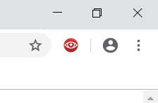
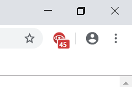

## PingBlock

### What is it?
An open-source Chrome extension to block click tracking.

### Why use it?
Some web sites collect data about where you click on the page.
Until now, many browsers have let the users choose whether to enable such tracking.
However, most of them have began removing this option recently.
This extension re-enables this functionality.

### What can it do?
* Block click tracking
* Display the number of tracking requests blocked on each site

### How does it work?
It removes `ping` attributes from hyperlinks.
This prevents them from sending POST request containing information about what the user clicked on.

### Screenshots

